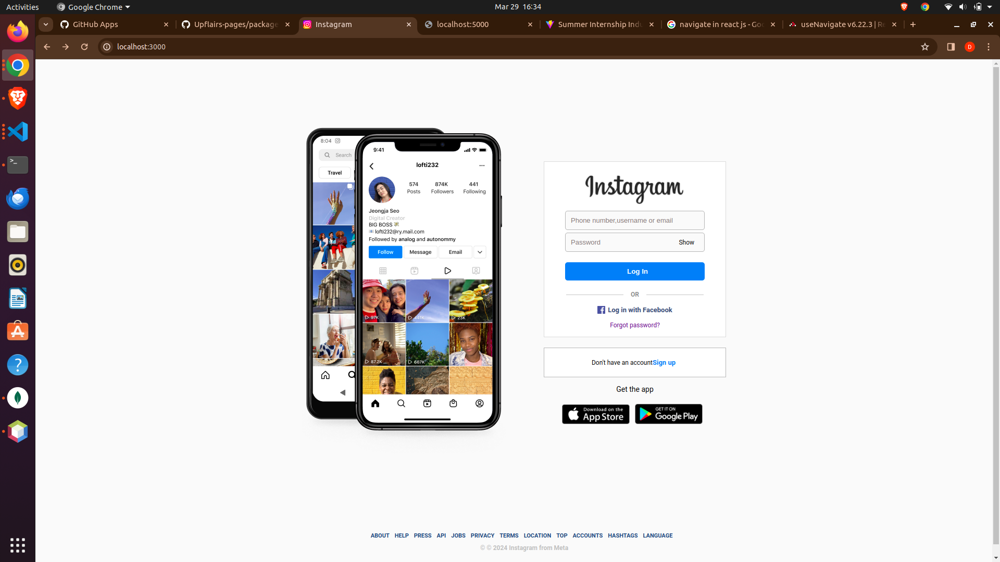

# Instagram Login Clone Project

This project is a basic Instagram Login clone created using React for the frontend, Express for the backend, and MongoDB as the database with Mongoose for object modeling. It aims to provide a simplified version of the Instagram platform for users to sign up, log in, and view posts.

## Features

- User authentication (sign up, log in)
- View posts
- Like and comment on posts

## Installation

1. Clone the repository to your local machine:

```bash
git clone https://github.com/Dharam-IN/instagram-login-clone-mern

Navigate to the project directory:

cd instagram-clone

Install dependencies for both frontend and backend:

cd frontend
npm install

cd ../Backend
npm install

Create a .env file in the backend directory and add the following environment variables:
## Preview


MONGO_URI=your_mongodb_uri

Replace your_mongodb_uri with your MongoDB connection URI.

Start the backend server:

cd backend
npm start

Start the frontend development server:

cd frontend
npm start

# Usage
Open http://localhost:3000 to view the frontend in your browser.
Use the provided sign-up and log-in functionality to create an account and log in.
View posts on the main feed.
Like and comment on posts.


Make sure to replace `dharam-in` with your GitHub username and update the MongoDB connection URI in the `.env` file accordingly. Also, add a screenshot named `screenshot.png` in the project directory to include it in your README.md file.
